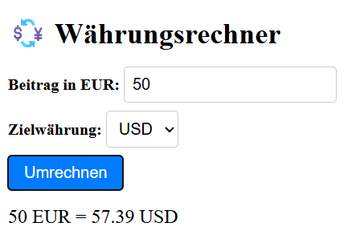

# 📝 Angular Currency Converter App

Ein kleines Übungsprojekt im Rahmen meiner Angular-Weiterentwicklung.  
Ziel: Einfache Währungsumrechnung von EUR in eine Zielwährung wie bspw. USD, GBP, JPY etc. basierend auf der European Central Bank (ECB) JSON-API

---

## 🚀 Features
- gewünschten Betrag in EUR eingeben
- Zielwährung über Dropdownmenü auswählen
- Nach Klick auf "Umrechnen" wird der aktuelle Kurs des jeweiligen Betrags angezeigt 

---

## 🛠️ Tech Stack
- Angular 19 (Standalone Components)
- TypeScript
- API
- CSS

---

## 📸 Vorschau 



---

## 📦 Projekt starten (lokal)

```bash
git clone https://github.com/MarcelBerlin/angular-todo-app.git
cd angular-todo-app
npm install
ng serve

---

